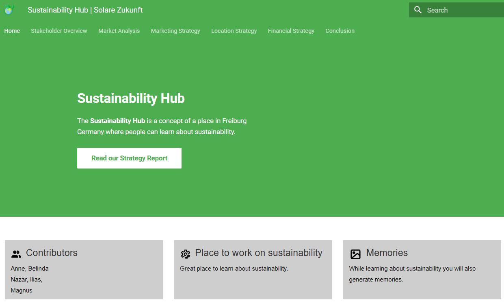

# Sustainability_Hub
This repository contains the public version of the Strategy Report from the SustainabilityHub-Team.
It is for hosting the report on GitHub Pages but it is also for providing the MkDocs file-structure before building the static webpage under [``serve``](serve/).

[Open the Report](https://sungsy.github.io/Sustainability_Hub/)

# Acknowledgement

- https://squidfunk.github.io/mkdocs-material/
